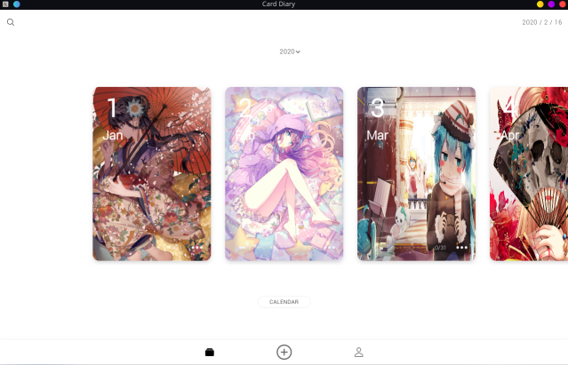
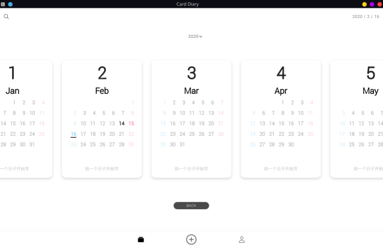
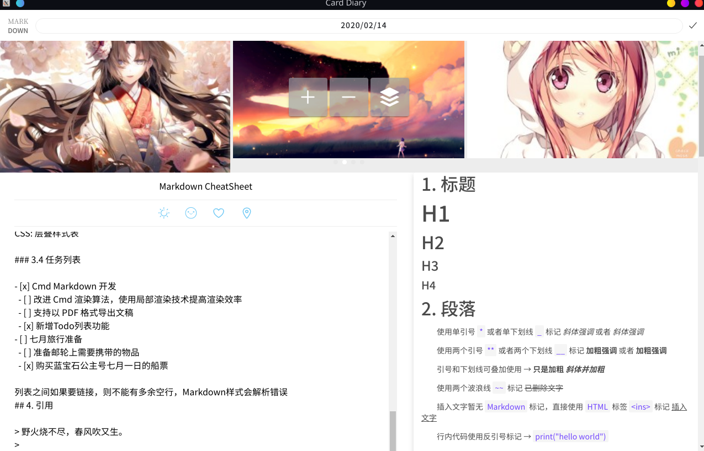
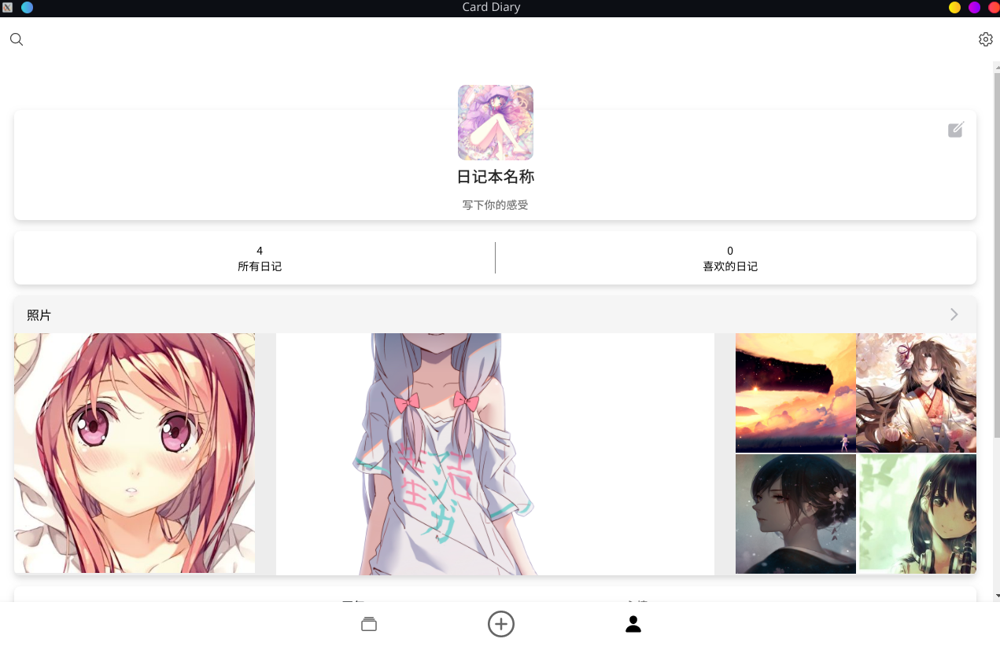

# 项目说明
Card Diary是一款日记软件，界面美观（UI灵感来源于Behance上的一个CardDiary项目）。由于本人需求，所以自己实现了3端版本,并且集成Markdown支持，免费提供给所有想要记日记的人。

## 项目架构
Ionic5/Angular + Parse 

## 项目预览

## 自定义服务器
[参考](https://github.com/Tuanz1/CardDiary-Parse.git)

## 联系
如果你有好的建议或者修改意见请联系我:670779246@qq.com